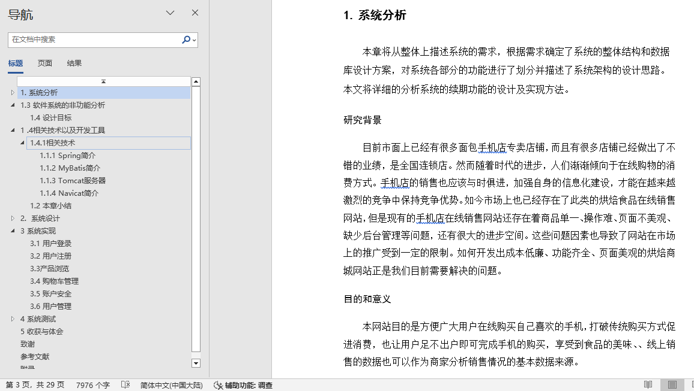
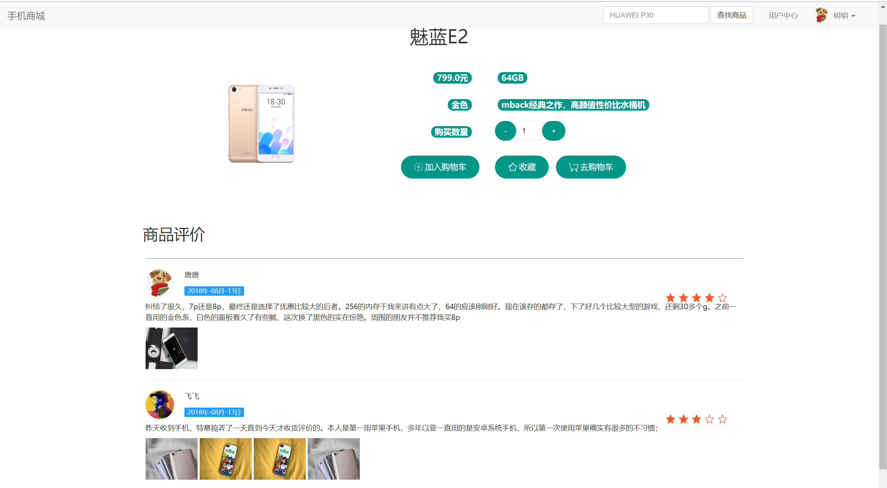
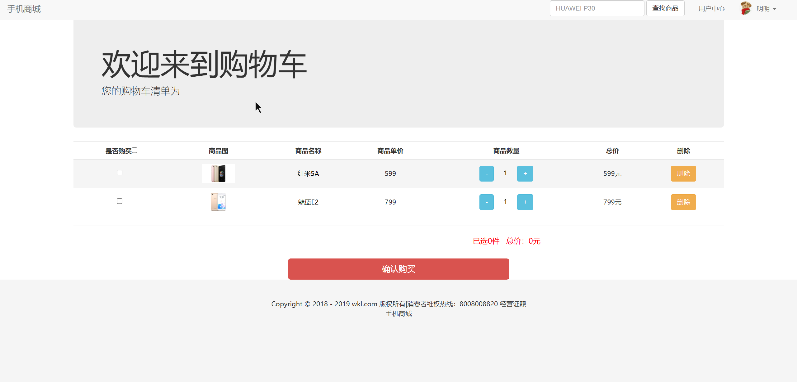
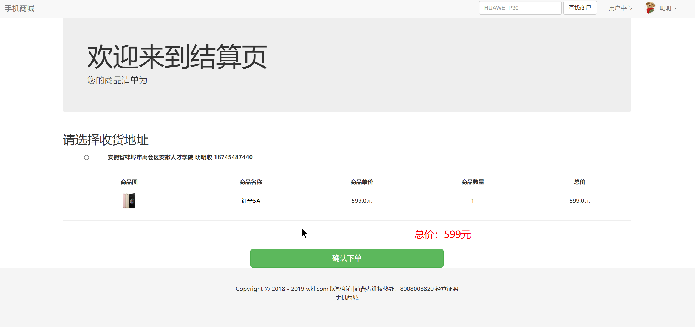
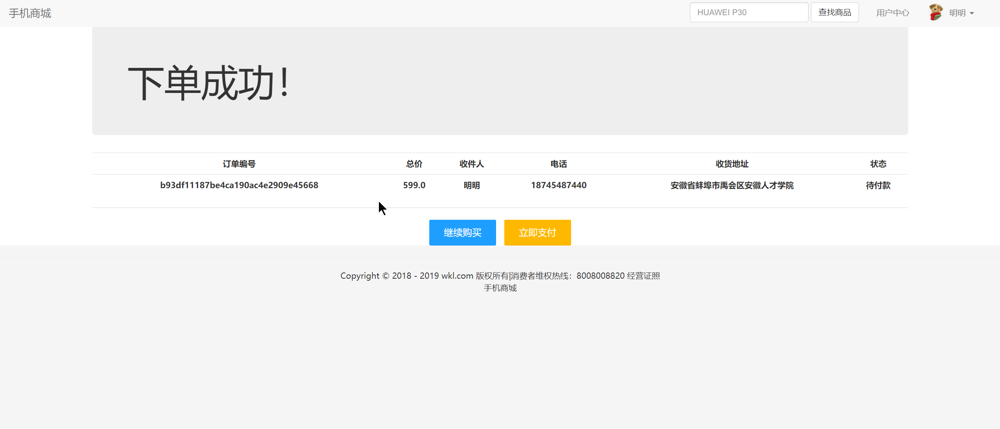
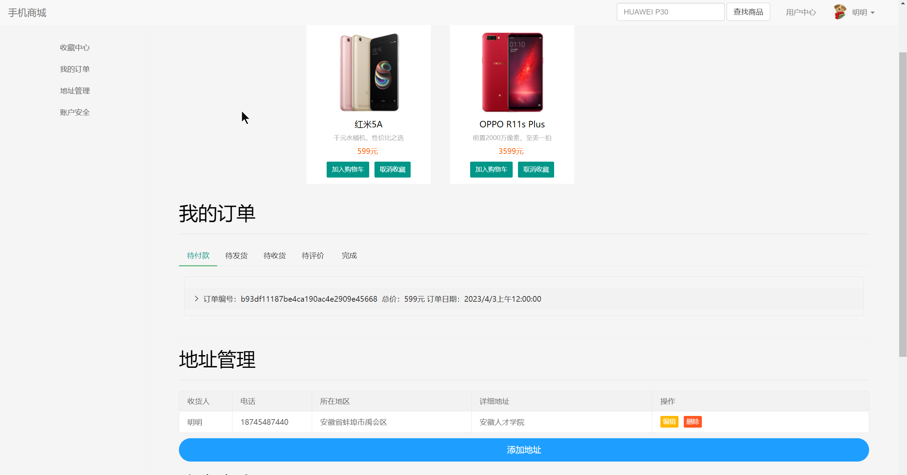
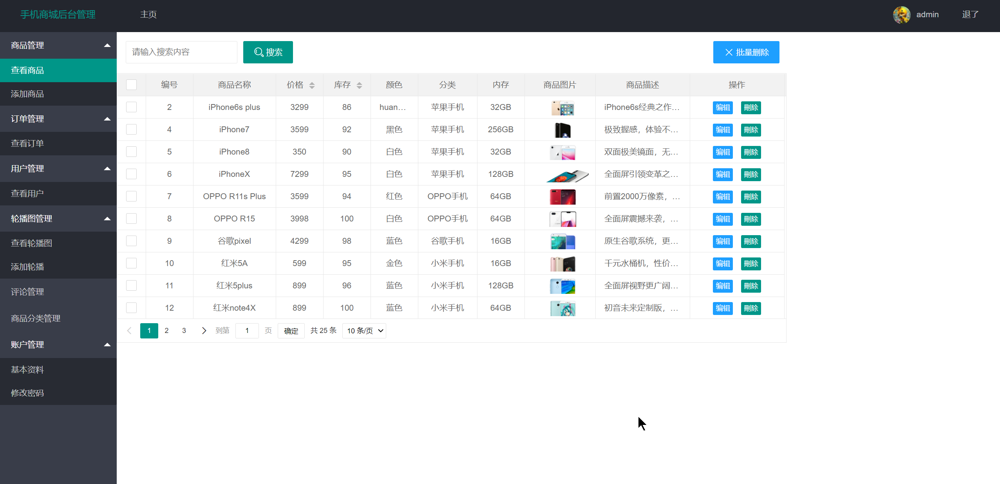
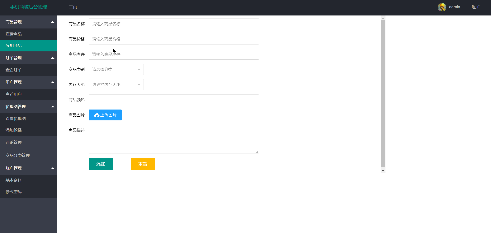
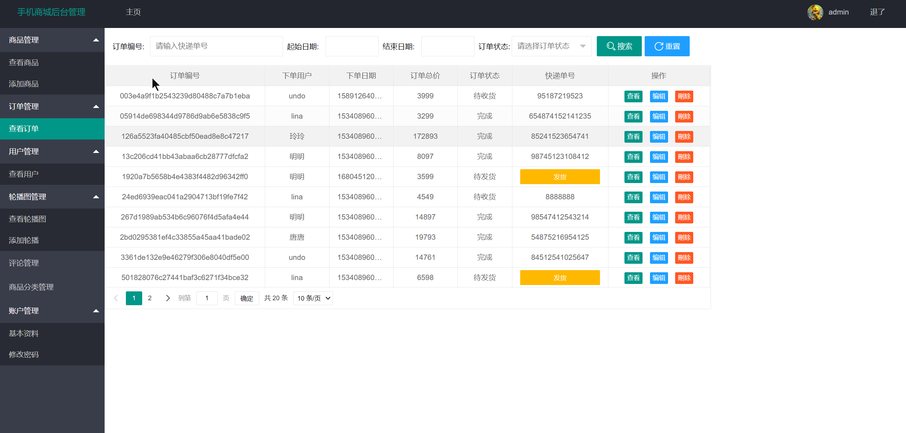
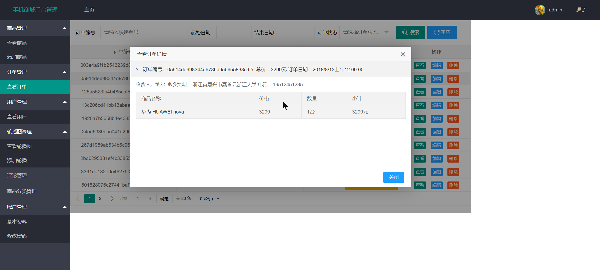

## 基于SSM框架实现的手机商城管理系统（程序+报告）

###  获取sql数据库文件: 从戎源码网 (https://armycodes.com/) QQ: 386869957 QQ群: 377586148
###  所有系统地址: (https://github.com/YuLin-Coder/AllProjectCatalog) 
###  所有项目以及源代码本人均调试运行无问题 可支持远程安装部署调试、定制修改、代码讲解

## 项目介绍
基于SSM框架实现的手机商城管理系统，本系统拥有用户和管理员两个角色，其中用户登录注册后，查看手机分类，手机商品下单加入购物车，生成订单，在线评价等功能；管理员对商品，分类，评价，轮播图，订单，用户等进行管理

系统分为用户和管理员两个角色
用户的主要功能有：
1.用户注册和登录手机商城
2.查看主页手机列表和分类，选择手机分类购买
3.用户在线搜索手机
4.查看手机商品详情，查看别的用户对商品的评价和打分
5.加入购物车，对手机下单，添加收货地址，下订单，查看订单信息
6.用户可以收藏手机商品
7.用户添加收货地址信息
8.用户个人中心，查看收藏，查看我的订单，修改密码
9.用户对购买的手机进行评价和打分
10.退出登录

管理员的功能有：
1.管理员登录系统后台
2.商品管理，管理员可以删除，修改，添加，查看手机信息
3.订单管理，查看，搜索，编辑，删除用户的订单，对用户的订单进行发货
4.用户管理，查询，编辑，删除用户，可以对用户进行禁用
5.轮播图管理，添加上传，编辑，查询，删除轮播图
6.评论管理，对用户的评价进行查看，删除
7.商品分类管理，添加，编辑，删除手机分类
8.账户管理，修改个人资料，修改密码
9.退出信息

## 项目技术
- 编程语言：Java
- 数据库：MySQL
- 前端技术：JSP、Jquery、Bootstrap、Layui
- 后端技术：Spring、SpringMVC、MyBatis

## 运行环境
- JDK版本：JDK1.8及以上
- 开发工具：IDEA、Ecplise、Myecplise都可以
- 数据库: MySQL5.7及以上

## 运行截图

